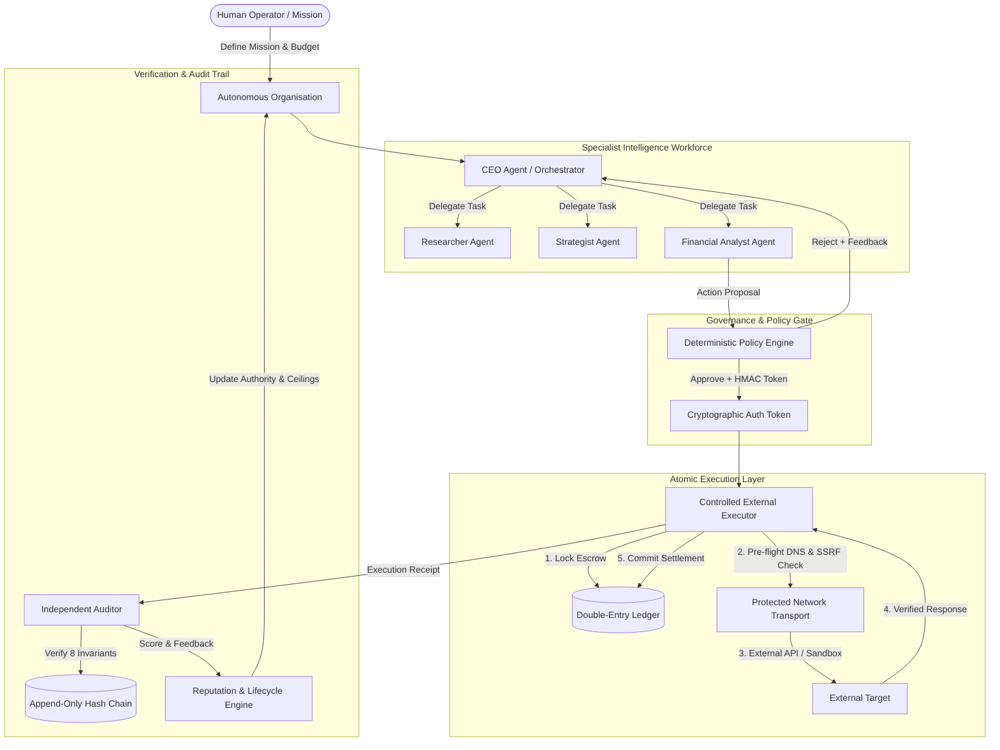

# Kalyx MAO Engine (Minimum Autonomous Organisation)

> **"Agents propose. Policies authorize. Executors execute. Auditors verify."**

Kalyx MAO Engine is an operating and governance layer for **Autonomous Organisations**—systems that receive a mission and finite resources, coordinate specialized AI agents, allocate scarce credits, enforce deterministic policies, execute approved Web2/Web3 actions, and remain accountable through cryptographic auditability and measured performance.

We are building a long-term production foundation, not a disposable hackathon demo.

---

## The Core Invariant

$$\text{AGENTS PROPOSE} \longrightarrow \text{POLICIES AUTHORIZE} \longrightarrow \text{EXECUTORS EXECUTE} \longrightarrow \text{AUDITORS VERIFY}$$

1. **Agents Propose**: Specialized LLM-powered agents formulate structured, typed proposals (`ActionProposal`) with explicit costs, rationale, risk assessments, and expected value. They have **zero** direct execution authority.
2. **Policies Authorize**: Deterministic policy rules evaluate proposals against budget limits, role permissions, destination allowlists, and risk ceilings. Approved proposals receive a cryptographically signed, single-use, TTL-bounded authorization token.
3. **Executors Execute**: Execution adapters verify policy approval, token validity, and emergency kill switches. External calls use atomic escrow reservation semantics (`AUTHORIZE -> RESERVE -> EXECUTE -> COMMIT`) and pre-flight DNS SSRF validation.
4. **Auditors Verify**: An independent auditor cryptographically checks the execution receipt, ledger settlement, credit conservation, task state, and audit hash chain before recording an immutable verification receipt.

---

## Architectural Overview



---

## Key Subsystems

### 1. Governance & Policy Engine (`src/governance/`)
- **Deterministic Evaluation**: Rules are evaluated without LLM involvement.
- **Rule Hierarchy**: Spend limits (`RULE-01`), destination allowlists (`RULE-02`), role permissions (`RULE-03`), risk score thresholds (`RULE-04`), and emergency kill switch (`RULE-05`).
- **Cryptographic Token Binding**: Authorization tokens are signed using HMAC-SHA256 (extensible via `ITokenSigner` / `ITokenVerifier` to Ed25519 or smart contracts). Tokens are strictly bound to organisation ID, proposal content hash, policy decision ID, policy version hash, issue timestamp, expiry TTL, and unique nonce.
- **Replay Protection**: Expired, replayed, or forged tokens are deterministically rejected.

### 2. Execution Layer & Atomicity (`src/execution/`)
- **Sandbox Executor**: Deterministic in-memory simulation for local testing and offline replay.
- **Controlled External Executor**:
  - **Escrow Reservation Semantics**: `AUTHORIZE -> RESERVE (Treasury -> Escrow) -> EXECUTE -> VERIFY -> COMMIT (Escrow -> External Sink)`.
  - **Zero Credit Loss on Failure**: On network timeout, connection drop, or HTTP $\ge 400$, escrowed funds are safely rolled back to `TREASURY` without consuming the authorization token.
  - **Pre-flight DNS & SSRF Protection**: Resolves all IPv4 and IPv6 addresses via `socket.getaddrinfo`, rejecting private (`10.0.0.0/8`, `172.16.0.0/12`, `192.168.0.0/16`), loopback (`127.0.0.1`, `::1`), link-local (`169.254.0.0/16`), and multicast subnets.
  - **Redirect & Payload Guards**: Intercepts HTTP redirects to prevent redirection to private IPs; enforces request/response byte limits (`max_payload_bytes`) and allowed HTTP methods (`GET`, `POST`).

### 3. Double-Entry Ledger (`src/economy/ledger.py`)
- **Mathematical Invariant**: Total credits minted $\equiv$ Sum of all account balances (`TREASURY`, `ESCROW`, `EXTERNAL_SINK`).
- **Overdraft Prevention**: Strict conservation of credits; no account balance can drop below zero.
- **Single Source of Truth**: Policy evaluation references the ledger directly; any out-of-band manipulation of `org.treasury_balance` is powerless.

### 4. Agent Workforce & Lifecycle (`src/agents/`, `src/economy/reputation.py`)
- **Strict Role Separation**:
  - **CEO**: Task planning, mission decomposition, and bounded replanning (max 3 cycles).
  - **Researcher**: Market analysis, external intelligence, evidence synthesis.
  - **Strategist**: Scenario comparison, trade-off analysis, option ranking.
  - **Financial Analyst**: Quantitative modeling, risk assessment, action proposals.
- **Structured Pydantic Schemas**: LLM responses are validated through strict schemas (`TaskPlanOutput`, `ResearchEvidenceOutput`, `StrategyOptionOutput`, `FinancialProposalOutput`).
- **5-State Lifecycle Machine**:
  - `ACTIVE` ($\ge 75.0$): Full authority ceiling and unconstrained actions.
  - `PROBATION` ($50.0 - 74.9$): Throttled budget, halved authority ceiling.
  - `RESTRICTED` ($30.0 - 49.9$): External actions stripped, zero authority ceiling.
  - `SUSPENDED` ($10.0 - 29.9$): Zero allocation, excluded from task assignment.
  - `RETIRED` ($< 10.0$): Permanent terminal decommission.
- **Multi-Factor Scoring**: Performance is evaluated dynamically based on task success rate, policy compliance, resource efficiency, and historical reliability.

### 5. Independent Auditor & Audit Chain (`src/audit/`)
- **8-Point Invariant Verification**:
  1. `PROPOSAL_FINGERPRINT`: Matches cryptographic content hash.
  2. `TOKEN_VALIDITY`: Valid signature, unexpired TTL, correct policy version.
  3. `AUTH_EXEC_BINDING`: Proposal ID and token match decision.
  4. `RECEIPT_INTEGRITY`: Cost, target, and action match authorization.
  5. `LEDGER_SETTLEMENT`: Verified double-entry transaction recorded.
  6. `AUDIT_CHAIN_INTEGRITY`: Append-only SHA-256 hash chain unbroken.
  7. `CREDIT_CONSERVATION`: Total system credits conserved.
  8. `STATE_CONSISTENCY`: Organisation not paused, task status consistent.
- **Cryptographic Event Store**: Append-only hash chain where each event includes `previous_event_hash` and canonical JSON payload hash. Process restart verifies audit chain before resumption.

### 6. Empirical Economic Benchmark (`src/economy/experiment.py`)
- Compares 3 allocation paradigms (`STATIC`, `PERFORMANCE`, `ADAPTIVE`) across multi-seed workloads:
  - **`STEADY_STATE`**: Predictable tasks with sustainable yields (STATIC suffices).
  - **`HIGH_RISK_MARKET`**: Volatile tasks with spend spikes (ADAPTIVE prevents violations and waste).
  - **`TREASURY_SHOCK`**: Severe capital scarcity (ADAPTIVE preserves solvency; STATIC goes bankrupt).
- Produces objective, reproducible empirical findings without hardcoded assumptions.

---

## Project Status

- [x] **Phase 1: Deterministic Foundation** (Entities, state machines, ledger, event store, policy engine, sandbox executor)
- [x] **Phase 2: Agent Architecture & Orchestration** (CEO, Researcher, Strategist, Financial Analyst, replan circuit breaker)
- [x] **Phase 3: Persistence & Verification** (SQLite engine, Auditor verification receipts, 12-step CLI runner, crash recovery)
- [x] **Phase 3.5: Cryptographic & Policy Hardening** (HMAC token TTL, policy version hashing, crypto abstraction)
- [x] **Phase 4: Agent Economy & Controlled Execution** (OpenRouter LLM adapter, controlled external adapter, multi-factor reputation, comparative experiment)
- [x] **Phase 4 Hardening Pass**: Escrow reservation atomicity, pre-flight DNS SSRF validation, redirect blocking, ledger authority fix, multi-scenario benchmark.
- [ ] **Phase 5: Command-Centre UI & Settlement Layer** (Real-time mission control dashboard, visual graph, policy telemetry, onchain settlement adapters)

---

## Installation & Quickstart

### Prerequisites
- Python 3.11+
- Git

### Setup
```bash
# Clone the repository
git clone https://github.com/A-Nuel/kalyx-mao-engine.git
cd kalyx-mao-engine

# Create and activate virtual environment
python -m venv .venv
# On Windows:
.venv\Scripts\activate
# On Linux/macOS:
source .venv/bin/activate

# Install dependencies
pip install -e .
pip install pytest pytest-asyncio httpx rich pydantic
```

### Running the Interactive 12-Step Demo
```bash
# Run with natural pauses for demonstration
python scripts/run_demo.py

# Run in accelerated fast mode
python scripts/run_demo.py --fast
```

### Running the Test Suite
```bash
# Run all 121 unit and integration tests
python -m pytest -v
```

---

## Verification & Test Coverage

The test suite contains **121 automated tests** across unit, integration, and adversarial suites with a **100% pass rate**:

```
======================= 121 passed in 89.93s (0:01:29) ========================
```

- **Adversarial & Attack Tests**: 10 tests (`test_adversarial.py`, tampering, replay attacks, forged tokens, kill-switch bypasses).
- **Execution Atomicity & Escrow**: 6 tests (`test_execution_atomicity.py`).
- **Network Security & SSRF**: 7 tests (`test_ssrf_and_network_security.py`).
- **Ledger Authority & Conservation**: 11 tests (`test_ledger.py`, `test_ledger_authority_regression.py`, `test_treasury_source_of_truth.py`).
- **Auditor & Hash Chain**: 14 tests (`test_auditor.py`, `test_hash_chain.py`, `test_audit_tamper_exhaustive.py`).
- **State Machines & Lifecycle**: 14 tests (`test_state_machine.py`, `test_state_machine_exhaustive.py`, `test_agent_economy_and_lifecycle.py`).
- **LLM Integration & Validation**: 8 tests (`test_openrouter_adapter.py`, `test_live_llm_integration.py`).
- **Process Restart & Persistence**: 4 tests (`test_sqlite_persistence.py`, `test_process_restart_recovery.py`, `test_real_subprocess_restart.py`).

---

## License

MIT License. Designed and architected for autonomous organisation infrastructure.
